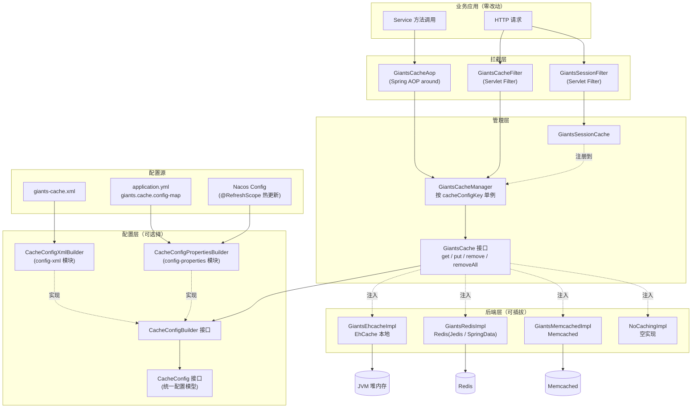
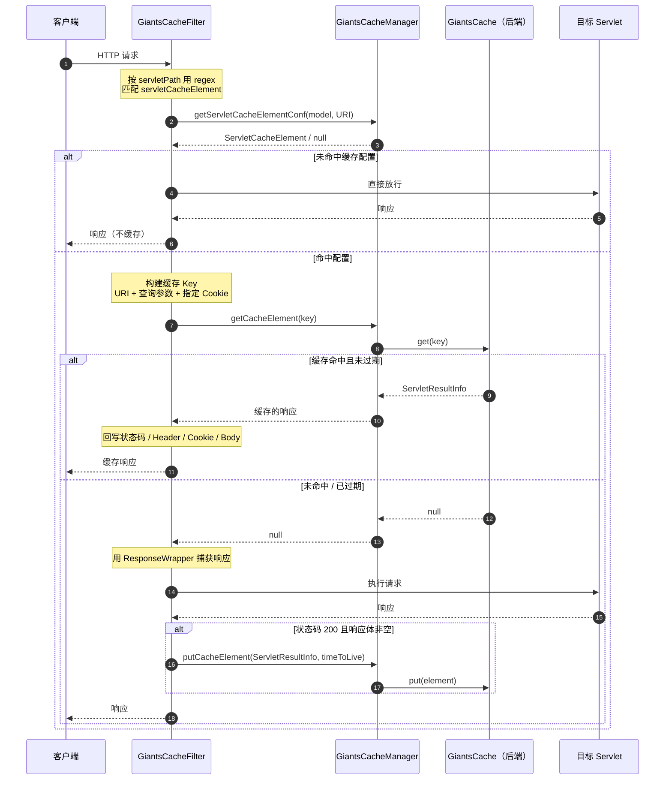
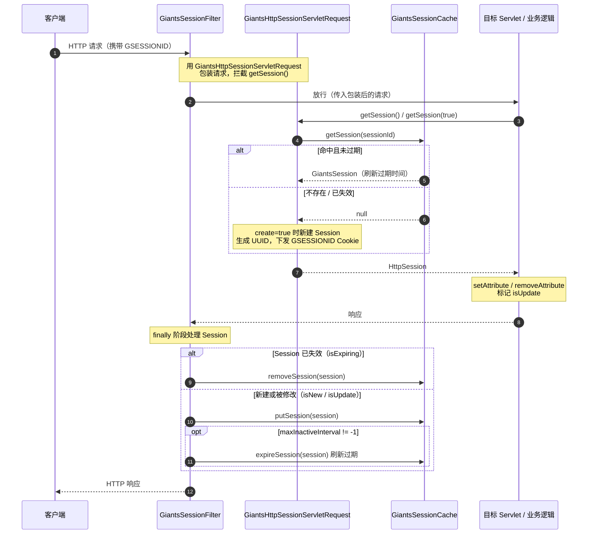

# giants-cache 使用手册

> 版本：1.2.0 ｜ groupId：`com.github.vencent-lu`

giants-cache 是一个**无 API 侵入**的 Java 缓存中间层。它支持 **XML 与 Properties/YAML 两种配置方式**，运行时以 AOP（方法层）和 Servlet Filter（Web 层）的方式拦截调用，把结果写入可插拔的缓存后端（EhCache / Redis / Memcached）。业务代码无需引入任何缓存 API。

**1.2.0 版本新特性**：
- 引入 `CacheConfigBuilder` 抽象，支持多种配置加载方式
- 新增 `giants-cache-config-xml` 与 `giants-cache-config-properties` 配置模块
- Properties/YAML 配置方式支持 `@RefreshScope`，配合 Nacos Config 实现**缓存规则热更新**
- 提供 Spring Boot 自动配置支持，简化接入流程

---

## 目录

1. [核心概念与架构](#1-核心概念与架构)
2. [安装与依赖](#2-安装与依赖)
3. [配置方式选择](#3-配置方式选择)
   - [3.1 XML 配置方式](#31-xml-配置方式)
   - [3.2 Properties/YAML 配置方式](#32-propertiesyaml-配置方式)
   - [3.3 配置方式对比](#33-配置方式对比)
4. [方法结果缓存（AOP）](#4-方法结果缓存aop)
5. [Servlet 响应缓存（Filter）](#5-servlet-响应缓存filter)
6. [缓存后端配置](#6-缓存后端配置)
   - [6.1 EhCache](#61-ehcache)
   - [6.2 Redis（Jedis）](#62-redisjedis)
   - [6.3 Redis（Spring Data Redis）](#63-redisspring-data-redis)
   - [6.4 Memcached](#64-memcached)
   - [6.5 无缓存实现](#65-无缓存实现)
7. [分布式 Session](#7-分布式-session)
8. [Redis 分布式锁](#8-redis-分布式锁)
9. [配置元素速查表](#9-配置元素速查表)
10. [常见问题（FAQ）](#10-常见问题faq)

---

## 1. 核心概念与架构

giants-cache 由以下几个核心角色构成：

| 角色 | 类型 | 职责 |
| --- | --- | --- |
| `CacheConfigBuilder` | 接口 | 配置加载器抽象：`build()` 方法返回 `CacheConfig`，由不同实现支持 XML / Properties 等加载方式 |
| `GiantsCache` | 接口 | 缓存后端统一抽象：`get` / `put` / `remove` / `removeAll`，持有 `CacheConfigBuilder` |
| `AbstractGinatsCache` | 抽象类 | `GiantsCache` 的基类，构造时接收 `CacheConfigBuilder` |
| `GiantsCacheManager` | 管理器 | 通过 `GiantsCache` 获取配置、按配置查找缓存元素、桥接后端实现，以 `cacheConfigKey` 为 key 维护单例 |
| `GiantsCacheAop` | AOP 切面 | 拦截方法调用，实现方法结果缓存 |
| `GiantsCacheFilter` | Servlet Filter | 拦截 HTTP 请求，实现响应缓存 |
| `GiantsSessionFilter` | Servlet Filter | 用缓存后端替换容器 Session |
| `CacheConfig` | 配置模型 | 缓存配置的统一接口，由 XML / Properties 对应的实现类提供 |

### 整体架构

giants-cache 采用「拦截层 → 管理层 → 配置层 → 后端层」的分层结构：拦截层无侵入地捕获方法调用与 HTTP 请求，管理层依据配置决定是否缓存并统一收敛到 `GiantsCache` 接口，配置层通过 `CacheConfigBuilder` 抽象支持多种加载方式，后端层则可插拔地对接不同缓存组件。



- **拦截层**：`GiantsCacheAop` 与两个 Filter 均不要求业务代码引入缓存 API，规则完全由外部配置驱动。
- **管理层**：`GiantsCacheManager` 以 `cacheConfigKey`（默认 `"default"`）为 key 维护单例，通过 `giantsCache.getCacheConfigBuilder().build()` 获取配置并转发读写请求；Session 缓存实现构造时自动注册到管理器。
- **配置层**：`CacheConfigBuilder` 接口抽象配置加载逻辑，`CacheConfigXmlBuilder` 解析 XML 文件，`CacheConfigPropertiesBuilder` 从 `@ConfigurationProperties` 读取，后者支持 `@RefreshScope` 实现热更新。
- **后端层**：所有后端实现同一 `GiantsCache` 接口且构造时接收 `CacheConfigBuilder`，切换后端只需替换 Spring 中的 `giantsCache` bean。

### 工作流程（方法缓存）

```
业务方法调用
    │
    ▼
GiantsCacheAop.serviceMethodCache(around 通知)
    │  ① 解析方法签名，构建 MethodCacheKey
    │  ② 向 GiantsCacheManager 查询该方法是否配置了缓存
    ▼
命中配置？
 ├─ 否 → 直接放行 service.proceed()
 └─ 是 → 查缓存
          ├─ 缓存存在且未过期 → 返回缓存值
          └─ 缓存不存在 / 已过期 → 执行方法 → 写入后端 → 返回
    │
    ▼
③ 检查是否触发关联清除（clearCache / cleanMethod）
```

### 关键设计点

- **配置加载抽象（CacheConfigBuilder）**：1.2.0 引入 `CacheConfigBuilder` 接口，支持 XML（`CacheConfigXmlBuilder`）与 Properties/YAML（`CacheConfigPropertiesBuilder`）两种加载方式，后续可扩展支持其他配置源。
- **缓存模型（cacheModel）**：一份配置里可定义多个模型，AOP 切面和 Filter 各自绑定一个模型名（`cacheModelName`），互不干扰。
- **实例按 cacheConfigKey 缓存**：`GiantsCacheManager.getInstance(cacheConfigKey)` 以配置 key（默认 `"default"`）为索引返回单例，切面与 Filter 通过同一 key 共享管理器。
- **构造函数依赖注入**：所有 `GiantsCache` 后端实现（`GiantsRedisImpl`、`GiantsEhcacheImpl` 等）构造函数**强制要求** `CacheConfigBuilder` 参数。
- **TTL 单位为秒**：`timeToLive` / `defaultTimeToLive` 单位是**秒**，默认 `300`（5 分钟）；取值 `-1` 表示永不过期。
- **缓存值需可序列化**：Redis / Memcached 后端会序列化对象（使用 Hessian2），被缓存的返回值、Session 属性等都应实现 `Serializable`。
- **动态刷新支持**：使用 `config-properties` 模块时，`GiantsCacheConfigProperties` 标注了 `@RefreshScope`，配合 Nacos Config 等配置中心可实现缓存规则热更新。

---

## 2. 安装与依赖

按所选后端引入对应模块（均已传递依赖 `giants-cache-core`）：

```xml
<!-- 三选一：后端实现 -->
<dependency>
    <groupId>com.github.vencent-lu</groupId>
    <artifactId>giants-cache-ehcache</artifactId>
    <version>1.2.0</version>
</dependency>

<dependency>
    <groupId>com.github.vencent-lu</groupId>
    <artifactId>giants-cache-redis</artifactId>
    <version>1.2.0</version>
</dependency>

<dependency>
    <groupId>com.github.vencent-lu</groupId>
    <artifactId>giants-cache-memcached</artifactId>
    <version>1.2.0</version>
</dependency>
```

**配置模块（二选一）**：根据配置方式选择对应模块

```xml
<!-- XML 配置方式 -->
<dependency>
    <groupId>com.github.vencent-lu</groupId>
    <artifactId>giants-cache-config-xml</artifactId>
    <version>1.2.0</version>
</dependency>

<!-- Properties/YAML 配置方式（支持动态刷新） -->
<dependency>
    <groupId>com.github.vencent-lu</groupId>
    <artifactId>giants-cache-config-properties</artifactId>
    <version>1.2.0</version>
</dependency>
```

> **注意**：`config-xml` 与 `config-properties` **只能引入其中一个**，两者都会通过 `spring.factories` 自动注册 `CacheConfigBuilder` bean，同时引入会导致冲突。传统 Spring 项目（非 Spring Boot）也可以不引入配置模块，手动装配 `CacheConfigBuilder`。

运行环境要求：

- JDK 1.7 及以上
- Spring 4.2.x（`spring-aop`、`spring-tx`、`spring-context`）
- Servlet 3.0+（仅在使用 `GiantsCacheFilter` / `GiantsSessionFilter` 时需要）
- 后端组件版本：EhCache 2.6.x、Jedis 2.8.x、Spring Data Redis 2.1.x、Memcached
- Spring Boot 2.5.x+（可选，使用自动配置时）
- Spring Cloud Context 3.0.x+（可选，使用 `@RefreshScope` 时）

---

## 3. 配置方式选择

giants-cache 1.2.0 支持两种配置方式，按项目需求选择其一。

### 3.1 XML 配置方式

**适用场景**：传统 Spring 项目、不需要动态刷新、习惯 XML 配置。

**配置文件**：`giants-cache.xml`（默认名称，可自定义），放在 classpath 根目录。

**优点**：结构清晰、层次分明，IDE 提示友好（配合 XSD）。

**缺点**：修改配置需要重启应用。

#### 3.1.1 XML 配置结构

> **XML 命名规则**：本框架使用自研的 `giants-xmlmapping` 解析 XML。元素标签名由 `@XmlEntity` 注解指定（通常为对应类名**首字母小写**）；属性名对应字段名（camelCase，如 `defaultTimeToLive`、`timeToLive`）。集合元素（`@XmlManyElement`）的标签名取**元素类型**的类名首字母小写。

```xml
<?xml version="1.0" encoding="UTF-8"?>
<cacheConfig name="...">                            <!-- 根，name 必填 -->

    <!-- 方法缓存模型，可多个 -->
    <methodCacheModel name="..." defaultCache="false" defaultTimeToLive="300">
        <cacheElement name="..." timeToLive="300">
            <exclusionMethod name="..."/>            <!-- 不缓存的方法，可多个 -->
            <cleanMethod name="..."/>                <!-- 触发清空本元素缓存的方法，可多个 -->
        </cacheElement>
        <clearCache name="...">                      <!-- 关联清除规则，可多个 -->
            <clearElement name="..."/>               <!-- 要连带清除的 cacheElement 名，可多个 -->
        </clearCache>
    </methodCacheModel>

    <!-- Servlet 响应缓存模型，可多个 -->
    <servletCacheModel name="..." defaultCache="false" defaultTimeToLive="300">
        <purgeServletCache name="..." purgeURIPrefix="/purge">   <!-- 可选，仅一个 -->
            <purgeIP value="127.0.0.1"/>             <!-- 允许发起 purge 的 IP，可多个 -->
        </purgeServletCache>
        <servletCacheElement name="..." timeToLive="300"
                regex="..." queryParam="true" cookie="false">
            <exclusionQueryParam name="..."/>        <!-- 计算缓存 Key 时忽略的查询参数，可多个 -->
            <cookieName name="..."/>                 <!-- 计算缓存 Key 时纳入的 Cookie 名，可多个 -->
        </servletCacheElement>
    </servletCacheModel>

</cacheConfig>
```

### 元素与属性说明

**`cacheConfig`（根元素）**

| 属性 | 必填 | 说明 |
| --- | --- | --- |
| `name` | 是 | 配置标识 |

**`methodCacheModel` / `servletCacheModel`（继承自 `CacheModel`）**

| 属性 | 默认值 | 说明 |
| --- | --- | --- |
| `name` | — | 模型名，AOP 的 `cacheModelName` / Filter 的 `cacheModelName` 与之对应 |
| `defaultCache` | `false` | 是否默认缓存：为 `true` 时，即使未显式配置某方法/URI，也会按 `defaultTimeToLive` 缓存 |
| `defaultTimeToLive` | `300` | 该模型下缓存的默认存活秒数 |

**`cacheElement`（方法缓存元素）**

| 属性 | 默认值 | 说明 |
| --- | --- | --- |
| `name` | — | 匹配目标：可为**类全名**、**方法全名**或**完整方法签名**（见 [第 4 节](#4-方法结果缓存aop)） |
| `timeToLive` | `300` | 存活秒数，`-1` 表示永不过期 |

- 子元素 `exclusionMethod name="方法简名或简单签名"`：当 `cacheElement` 按类名匹配时，排除这些方法不缓存。
- 子元素 `cleanMethod name="方法简名或简单签名"`：调用这些方法时清空该 `cacheElement` 的所有缓存（用于写操作后失效缓存）。

**`servletCacheElement`（Servlet 缓存元素，继承 `cacheElement`）**

| 属性 | 默认值 | 说明 |
| --- | --- | --- |
| `name` | — | 缓存元素名（用于 Purge 定位） |
| `timeToLive` | `300` | 存活秒数 |
| `regex` | — | 匹配请求 `servletPath` 的正则表达式 |
| `queryParam` | `true` | 是否把查询参数纳入缓存 Key |
| `cookie` | `false` | 是否把 Cookie 纳入缓存 Key |

- 子元素 `exclusionQueryParam name="参数名"`：`queryParam=true` 时，从缓存 Key 中排除这些参数。
- 子元素 `cookieName name="Cookie名"`：`cookie=true` 时，仅这些 Cookie 会纳入缓存 Key（未列出的 Cookie 一律忽略）。

**`clearCache` / `clearElement`（关联清除）**

- `clearCache name="X"`：当被调用的方法（其 Key 命中 X 的类名/方法名/签名）执行后，连带清除 `clearElement` 列出的各缓存元素。
- `clearElement name="Y"`：`Y` 为要清除的 `cacheElement` 名（通常是另一个类的缓存）。

**`purgeServletCache` / `purgeIP`（远程清除）**

- `purgeURIPrefix`：清除请求的 URI 前缀。访问 `{purgeURIPrefix}{目标URI}` 且来源 IP 在白名单内时，清除该目标 URI 的缓存。
- `purgeIP value="IP"`：允许发起清除的客户端 IP 白名单。

#### 3.1.2 Spring Boot 自动配置（XML 方式）

引入 `giants-cache-config-xml` 后，在 `application.yml` 配置：

```yaml
giants:
  cache:
    cache-config-key: default                    # 可选，默认 "default"
    cache-config-xml-file-path: giants-cache.xml # 可选，默认 "giants-cache.xml"
```

自动配置会创建 `CacheConfigBuilder` bean，业务代码只需装配后端和 AOP/Filter。

### 3.2 Properties/YAML 配置方式

**适用场景**：Spring Boot 项目、需要集中管理配置、需要配合 Nacos 等配置中心实现动态刷新。

**配置位置**：`application.yml` 或 `application.properties`，通过 `giants.cache.config-map` 定义缓存规则。

**优点**：支持 `@RefreshScope` 热更新、与 Spring Boot 配置体系统一、可直接对接 Nacos Config。

**缺点**：嵌套结构在 YAML 中可能较长。

#### 3.2.1 Properties/YAML 配置结构

```yaml
giants:
  cache:
    name: giants-cache                           # 配置名称
    config-map:                                  # Map<String, CacheConfig>
      default:                                   # cacheConfigKey（可多个）
        name: giants-cache
        method-cache-models:                     # List<MethodCacheModel>
          - name: serviceCache                   # 模型名
            default-cache: false
            default-time-to-live: 600            # 默认 TTL（秒）
            cache-elements:                      # List<CacheElement>
              - name: com.example.service.UserService
                time-to-live: 300
                clean-methods:                   # 触发清空的方法
                  - name: updateUser
                  - name: deleteUser
                exclusion-methods:               # 不缓存的方法
                  - name: sendVerifyCode
            clear-caches:                        # List<ClearCache> 关联清除
              - name: com.example.service.OrderService.createOrder
                clear-elements:
                  - name: com.example.service.StatService
        servlet-cache-models:                    # List<ServletCacheModel>
          - name: servlet
            default-cache: false
            default-time-to-live: 300
            purge-servlet-cache:                 # 可选，远程清除配置
              name: purge
              purge-uri-prefix: /purge
              purge-ips:
                - value: 127.0.0.1
            servlet-cache-elements:              # List<ServletCacheElement>
              - name: productDetail
                time-to-live: 60
                regex: /product/.*\.html         # URI 正则匹配
                query-param: true                # 查询参数纳入 Key
                cookie: true                     # Cookie 纳入 Key
                exclusion-query-params:          # 排除的查询参数
                  - name: _t
                cookie-names:                    # 纳入 Key 的 Cookie 名
                  - name: lang
```

#### 3.2.2 Spring Boot 自动配置（Properties 方式）

引入 `giants-cache-config-properties` 后，自动配置会创建 `CacheConfigBuilder` bean 并启用 `@RefreshScope`。

**配合 Nacos Config 实现动态刷新**：

1. 添加依赖：
```xml
<dependency>
    <groupId>com.alibaba.cloud</groupId>
    <artifactId>spring-cloud-starter-alibaba-nacos-config</artifactId>
</dependency>
```

2. 配置 Nacos：
```yaml
spring:
  cloud:
    nacos:
      config:
        server-addr: 127.0.0.1:8848
        file-extension: yaml
```

3. 在 Nacos 控制台创建 Data ID 为 `${spring.application.name}.yaml` 的配置，内容为上述 `giants.cache.*` 部分。

4. 修改 Nacos 配置后，应用会自动接收更新，`GiantsCacheManager` 重新 `build()` 配置，**无需重启**。

### 3.3 配置方式对比

| 特性 | XML 配置 | Properties/YAML 配置 |
| --- | --- | --- |
| 配置位置 | `giants-cache.xml` | `application.yml` / Nacos |
| 结构清晰度 | ★★★★★（层次分明） | ★★★☆☆（嵌套较深） |
| 动态刷新 | ✗ 需重启 | ✓ 支持 `@RefreshScope` |
| 配置中心集成 | ✗ | ✓ 原生支持 Nacos / Apollo |
| Spring Boot 集成 | ★★★☆☆ | ★★★★★ |
| 推荐场景 | 传统 Spring / 配置稳定 | Spring Boot / 需要热更新 |

---

## 4. 方法结果缓存（AOP）

方法缓存通过 `GiantsCacheAop` 切面实现。它在方法执行前后拦截：命中缓存则直接返回缓存值，否则执行方法并写入缓存。

### 4.1 切面属性

`com.giants.cache.core.aop.GiantsCacheAop` 可注入以下属性：

| 属性 | 默认值 | 说明 |
| --- | --- | --- |
| `cacheModelName` | — | 使用的缓存模型名，对应配置中某个 `methodCacheModel` 的 `name` |
| `cacheConfigKey` | — | 配置 key，对应 `CacheConfigBuilder` 的 key（默认 `"default"`），用于获取 `GiantsCacheManager` 单例 |
| `supportMultipleInstance` | `false` | 为 `true` 且目标对象实现 `Serializable` 时，会把目标实例纳入缓存 Key（区分不同实例的同名方法调用） |

切面入口方法为 `serviceMethodCache(ProceedingJoinPoint)`，需以 **around** 通知绑定。

### 4.2 Spring 配置

#### 4.2.1 传统 Spring XML 配置

```xml
<!-- 配置加载器（XML 方式） -->
<bean id="cacheConfigBuilder" class="com.giants.cache.config.xml.CacheConfigXmlBuilder">
    <constructor-arg value="default"/>                <!-- cacheConfigKey -->
    <constructor-arg value="giants-cache.xml"/>       <!-- XML 文件路径 -->
</bean>

<!-- 后端实现（以 Redis 为例） -->
<bean id="redisClient" class="com.giants.cache.redis.JedisClientImpl">
    <property name="jedisPool" ref="jedisPool"/>      <!-- jedisPool 配置见 6.2 节 -->
</bean>
<bean id="giantsCache" class="com.giants.cache.redis.impl.GiantsRedisImpl">
    <constructor-arg ref="cacheConfigBuilder"/>       <!-- 必须注入 builder -->
    <property name="redisClient" ref="redisClient"/>
</bean>
<bean id="giantsCacheManager" class="com.giants.cache.core.GiantsCacheManager">
    <constructor-arg ref="giantsCache"/>
</bean>

<!-- AOP 切面 -->
<bean id="giantsCacheAop" class="com.giants.cache.core.aop.GiantsCacheAop">
    <property name="cacheModelName" value="serviceCache"/>
    <property name="cacheConfigKey" value="default"/>  <!-- 对应 builder 的 key -->
</bean>

<aop:config>
    <aop:aspect ref="giantsCacheAop">
        <aop:pointcut id="servicePointcut"
            expression="execution(* com.example.service..*.*(..))"/>
        <aop:around method="serviceMethodCache" pointcut-ref="servicePointcut"/>
    </aop:aspect>
</aop:config>
```

#### 4.2.2 Spring Boot + Java Config

```java
@Configuration
@EnableAspectJAutoProxy
public class CacheConfiguration {
    
    // CacheConfigBuilder 由 config-xml 或 config-properties 模块自动注册
    
    @Bean
    public GiantsCache giantsCache(CacheConfigBuilder cacheConfigBuilder, RedisClient redisClient) {
        GiantsRedisImpl cache = new GiantsRedisImpl(cacheConfigBuilder);
        cache.setRedisClient(redisClient);
        return cache;
    }
    
    @Bean
    public GiantsCacheManager giantsCacheManager(GiantsCache giantsCache) {
        return new GiantsCacheManager(giantsCache);
    }
    
    @Bean
    public GiantsCacheAop giantsCacheAop() {
        GiantsCacheAop aop = new GiantsCacheAop();
        aop.setCacheModelName("serviceCache");
        aop.setCacheConfigKey("default");
        return aop;
    }
    
    @Bean
    public Advisor giantsCacheAdvisor(GiantsCacheAop giantsCacheAop) {
        AspectJExpressionPointcut pointcut = new AspectJExpressionPointcut();
        pointcut.setExpression("execution(* com.example.service..*.*(..))");
        
        DefaultPointcutAdvisor advisor = new DefaultPointcutAdvisor();
        advisor.setPointcut(pointcut);
        advisor.setAdvice((MethodInterceptor) invocation -> 
            giantsCacheAop.serviceMethodCache(new MethodInvocationProceedingJoinPoint(invocation))
        );
        return advisor;
    }
}
```

> 需开启 `<aop:aspectj-autoproxy/>` 或使用 `@EnableAspectJAutoProxy`。切面同样可用注解式 AspectJ 或 `@Aspect` 包装，核心是把 `serviceMethodCache` 作为 around 通知。

### 4.3 cacheElement 的三级匹配

AOP 会把被调方法解析成一个完整签名，例如：

```
com.example.service.UserService.getUser(java.lang.Long)
```

查找缓存配置时，按**由细到粗**的顺序匹配 `cacheElement` 的 `name`：

1. **完整签名**：`com.example.service.UserService.getUser(java.lang.Long)`
2. **方法全名**（不含参数）：`com.example.service.UserService.getUser`
3. **类全名**：`com.example.service.UserService`

任一层级命中即生效。这意味着：

- 配 **类全名** → 缓存该类所有方法（可用 `exclusionMethod` 排除个别方法）。
- 配 **方法全名** → 缓存该方法的所有重载。
- 配 **完整签名** → 精确到某个重载。

`exclusionMethod` / `cleanMethod` 的 `name` 使用**方法简名**（如 `getUser`）或**简单签名**（如 `getUser(java.lang.Long)`）。

> 说明：返回值为 `void` 的方法不会被缓存；若该方法在某个按类名匹配的 `cacheElement` 的 `cleanMethod` 列表中，则调用后会清空该元素缓存。

### 4.4 缓存失效：cleanMethod 与 clearCache

- **cleanMethod（本类内失效）**：写方法（如 `updateUser`）执行后，清空所属 `cacheElement` 的全部缓存。

```xml
<cacheElement name="com.example.service.UserService" timeToLive="300">
    <cleanMethod name="updateUser"/>
    <cleanMethod name="deleteUser"/>
</cacheElement>
```

- **clearCache（跨元素关联失效）**：当某方法执行后，需要连带清除**其他**缓存元素时使用。

```xml
<methodCacheModel name="serviceCache">
    <cacheElement name="com.example.service.OrderService"/>
    <cacheElement name="com.example.service.StatService"/>

    <!-- OrderService 变更后，连带清空 StatService 的缓存 -->
    <clearCache name="com.example.service.OrderService.createOrder">
        <clearElement name="com.example.service.StatService"/>
    </clearCache>
</methodCacheModel>
```

`clearCache` 的 `name` 同样支持类名 / 方法全名 / 完整签名三级匹配。

---

## 5. Servlet 响应缓存（Filter）

`GiantsCacheFilter` 缓存完整的 HTTP 响应（状态码、Content-Type、Header、Cookie、响应体），适用于内容页、接口等 GET 型只读响应。

### 5.1 缓存判定与行为

- 按请求的 `servletPath` 用 `servletCacheElement` 的 `regex` 正则匹配，命中才缓存。
- 仅当响应**状态码为 200** 且**响应体非空**时写入缓存。
- 缓存 Key = URI +（可选）查询参数 +（可选）指定 Cookie。
- 命中缓存时，按存储的 Header / Cookie / 状态码 / Content-Type / 响应体原样回写。

### 5.2 web.xml 配置

```xml
<filter>
    <filter-name>giantsCacheFilter</filter-name>
    <filter-class>com.giants.cache.core.filter.GiantsCacheFilter</filter-class>
    <init-param>
        <param-name>cacheModelName</param-name>
        <param-value>servlet</param-value>              <!-- 默认 servlet -->
    </init-param>
    <init-param>
        <param-name>cacheConfigKey</param-name>
        <param-value>default</param-value>              <!-- 默认 default -->
    </init-param>
</filter>
<filter-mapping>
    <filter-name>giantsCacheFilter</filter-name>
    <url-pattern>/*</url-pattern>
</filter-mapping>
```

> `cacheModelName` / `cacheConfigKey` 也可通过对应 setter 注入（Filter 继承自 `giants-web` 的 `AbstractFilter`，支持 init-param 与容器初始化）。

### 5.3 配置示例

```xml
<servletCacheModel name="servlet" defaultTimeToLive="300">
    <purgeServletCache name="purge" purgeURIPrefix="/purge">
        <purgeIP value="127.0.0.1"/>
        <purgeIP value="10.0.0.5"/>
    </purgeServletCache>

    <!-- 缓存 /product/ 下的详情页 60 秒，忽略 _t 参数，按 lang Cookie 区分 -->
    <servletCacheElement name="productDetail" timeToLive="60"
            regex="/product/.*\.html" queryParam="true" cookie="true">
        <exclusionQueryParam name="_t"/>
        <cookieName name="lang"/>
    </servletCacheElement>
</servletCacheModel>
```

### 5.4 远程清除（Purge）

配置了 `purgeServletCache` 后，白名单 IP 访问 `{purgeURIPrefix}{目标URI}` 即可清除对应缓存。例如上例中，从 `127.0.0.1` 访问：

```
GET /purge/product/123.html
```

将清除 `/product/123.html` 的缓存，随后重定向到清除后的 URI。非白名单 IP 的清除请求会被忽略。

### 5.5 请求处理时序图

`GiantsCacheFilter` 只负责响应数据缓存，与 [第 7 节](#7-分布式-session) 的会话管理彼此独立。下图展示一次请求的响应缓存处理过程，`GiantsCache` 为缓存后端实现（`GiantsEhcacheImpl` / `GiantsRedisImpl` / `GiantsMemcachedImpl` 之一）。



**要点：**

- 先按 `regex` 匹配 `servletCacheElement`，未命中配置的请求直接放行、不参与缓存。
- 缓存 Key 由 URI +（可选）查询参数 +（可选）指定 Cookie 组成。
- 仅当**状态码 200 且响应体非空**时写入缓存；命中时原样回放状态码、Header、Cookie 与 Body。

---

## 6. 缓存后端配置

所有后端都实现 `GiantsCache` 接口，**构造函数强制要求 `CacheConfigBuilder` 参数**，并通过 `GiantsCacheManager` 桥接：

```xml
<bean id="giantsCacheManager" class="com.giants.cache.core.GiantsCacheManager">
    <constructor-arg ref="giantsCache"/>   <!-- giantsCache 为具体后端实现 -->
</bean>
```

下面分别给出各后端 `giantsCache` bean 的配置方式。

### 6.1 EhCache

本地 JVM 缓存，实现类 `com.giants.cache.ehcache.impl.GiantsEhcacheImpl`。它使用 EhCache 的 `CacheManager`，**每个缓存模型名对应一个 EhCache `<cache name="...">`**，因此需要额外的 `ehcache.xml`。

#### 6.1.1 传统 Spring XML 配置

```xml
<!-- 配置加载器 -->
<bean id="cacheConfigBuilder" class="com.giants.cache.config.xml.CacheConfigXmlBuilder">
    <constructor-arg value="default"/>
    <constructor-arg value="giants-cache.xml"/>
</bean>

<!-- Spring 托管 EhCache CacheManager -->
<bean id="ehcacheManager"
      class="org.springframework.cache.ehcache.EhCacheManagerFactoryBean">
    <property name="configLocation" value="classpath:ehcache.xml"/>
</bean>

<bean id="giantsCache" class="com.giants.cache.ehcache.impl.GiantsEhcacheImpl">
    <constructor-arg ref="cacheConfigBuilder"/>      <!-- 必须注入 builder -->
    <property name="cacheManager" ref="ehcacheManager"/>
</bean>

<bean id="giantsCacheManager" class="com.giants.cache.core.GiantsCacheManager">
    <constructor-arg ref="giantsCache"/>
</bean>
```

#### 6.1.2 Spring Boot + Java Config

```java
@Configuration
public class EhCacheConfiguration {
    
    @Bean
    public GiantsCache giantsCache(CacheConfigBuilder cacheConfigBuilder) {
        GiantsEhcacheImpl cache = new GiantsEhcacheImpl(cacheConfigBuilder);
        // cacheManager 默认使用 CacheManager.getInstance()
        // 如需自定义，通过 cache.setCacheManager() 注入
        return cache;
    }
    
    @Bean
    public GiantsCacheManager giantsCacheManager(GiantsCache giantsCache) {
        return new GiantsCacheManager(giantsCache);
    }
}
```

> 若不注入 `cacheManager`，实现会默认使用 `CacheManager.getInstance()`（读取 classpath 下默认 `ehcache.xml`）。

`ehcache.xml` 中需为每个用到的 `cacheModelName` 声明同名 cache：

```xml
<ehcache>
    <defaultCache maxElementsInMemory="10000" eternal="false"
                  overflowToDisk="false"/>
    <!-- 名称需与 methodCacheModel/servletCacheModel 的 name 一致 -->
    <cache name="serviceCache" maxElementsInMemory="10000"
           timeToLiveSeconds="0" overflowToDisk="false"/>
</ehcache>
```

> 注：过期由 giants-cache 依据 `timeToLive` 控制，EhCache 层可将 `timeToLiveSeconds` 设为 0（不由 EhCache 过期）或按需配置。EhCache 模块还提供 `EhCacheEventListener`，用于在元素被驱逐时同步清理内部维护的 Key 列表。

### 6.2 Redis（Jedis）

实现类 `com.giants.cache.redis.impl.GiantsRedisImpl`，通过 `RedisClient` 抽象访问 Redis。Jedis 客户端为 `com.giants.cache.redis.JedisClientImpl`。

#### 6.2.1 传统 Spring XML 配置

```xml
<!-- 配置加载器 -->
<bean id="cacheConfigBuilder" class="com.giants.cache.config.xml.CacheConfigXmlBuilder">
    <constructor-arg value="default"/>
    <constructor-arg value="giants-cache.xml"/>
</bean>

<!-- Jedis 连接池 -->
<bean id="jedisPoolConfig" class="redis.clients.jedis.JedisPoolConfig">
    <property name="maxTotal" value="100"/>
    <property name="maxIdle" value="20"/>
    <property name="minIdle" value="5"/>
</bean>

<bean id="jedisPool" class="redis.clients.jedis.JedisPool">
    <constructor-arg ref="jedisPoolConfig"/>
    <constructor-arg value="127.0.0.1"/>
    <constructor-arg value="6379" type="int"/>
</bean>

<bean id="redisClient" class="com.giants.cache.redis.JedisClientImpl">
    <property name="jedisPool" ref="jedisPool"/>
</bean>

<!-- 缓存后端 -->
<bean id="giantsCache" class="com.giants.cache.redis.impl.GiantsRedisImpl">
    <constructor-arg ref="cacheConfigBuilder"/>      <!-- 必须注入 builder -->
    <property name="redisClient" ref="redisClient"/>
</bean>

<bean id="giantsCacheManager" class="com.giants.cache.core.GiantsCacheManager">
    <constructor-arg ref="giantsCache"/>
</bean>
```

#### 6.2.2 Spring Boot + Java Config

```java
@Configuration
public class RedisCacheConfiguration {
    
    @Bean
    public JedisPool jedisPool() {
        JedisPoolConfig config = new JedisPoolConfig();
        config.setMaxTotal(100);
        config.setMaxIdle(20);
        config.setMinIdle(5);
        return new JedisPool(config, "127.0.0.1", 6379);
    }
    
    @Bean
    public RedisClient redisClient(JedisPool jedisPool) {
        JedisClientImpl client = new JedisClientImpl();
        client.setJedisPool(jedisPool);
        return client;
    }
    
    @Bean
    public GiantsCache giantsCache(CacheConfigBuilder cacheConfigBuilder, RedisClient redisClient) {
        GiantsRedisImpl cache = new GiantsRedisImpl(cacheConfigBuilder);
        cache.setRedisClient(redisClient);
        return cache;
    }
    
    @Bean
    public GiantsCacheManager giantsCacheManager(GiantsCache giantsCache) {
        return new GiantsCacheManager(giantsCache);
    }
}
```

Redis 后端以 Set 记录每个 `elementConfName` 对应的所有 Key，`removeAll` 时批量清除；对象序列化采用 Hessian2。

### 6.3 Redis（Spring Data Redis）

若项目已使用 Spring Data Redis，可改用 `com.giants.cache.redis.SpringDataRedisClient`，注入 `RedisTemplate<byte[], byte[]>`。

#### 6.3.1 传统 Spring XML 配置

```xml
<!-- 配置加载器 -->
<bean id="cacheConfigBuilder" class="com.giants.cache.config.xml.CacheConfigXmlBuilder">
    <constructor-arg value="default"/>
    <constructor-arg value="giants-cache.xml"/>
</bean>

<!-- Spring Data Redis -->
<bean id="jedisConnectionFactory"
      class="org.springframework.data.redis.connection.jedis.JedisConnectionFactory">
    <property name="hostName" value="127.0.0.1"/>
    <property name="port" value="6379"/>
</bean>

<bean id="redisTemplate" class="org.springframework.data.redis.core.RedisTemplate">
    <property name="connectionFactory" ref="jedisConnectionFactory"/>
</bean>

<bean id="redisClient" class="com.giants.cache.redis.SpringDataRedisClient">
    <property name="redisTemplate" ref="redisTemplate"/>
</bean>

<!-- 缓存后端 -->
<bean id="giantsCache" class="com.giants.cache.redis.impl.GiantsRedisImpl">
    <constructor-arg ref="cacheConfigBuilder"/>      <!-- 必须注入 builder -->
    <property name="redisClient" ref="redisClient"/>
</bean>

<bean id="giantsCacheManager" class="com.giants.cache.core.GiantsCacheManager">
    <constructor-arg ref="giantsCache"/>
</bean>
```

#### 6.3.2 Spring Boot + Java Config

```java
@Configuration
public class SpringDataRedisCacheConfiguration {
    
    @Bean
    public RedisTemplate<byte[], byte[]> redisTemplate(RedisConnectionFactory factory) {
        RedisTemplate<byte[], byte[]> template = new RedisTemplate<>();
        template.setConnectionFactory(factory);
        return template;
    }
    
    @Bean
    public RedisClient redisClient(RedisTemplate<byte[], byte[]> redisTemplate) {
        SpringDataRedisClient client = new SpringDataRedisClient();
        client.setRedisTemplate(redisTemplate);
        return client;
    }
    
    @Bean
    public GiantsCache giantsCache(CacheConfigBuilder cacheConfigBuilder, RedisClient redisClient) {
        GiantsRedisImpl cache = new GiantsRedisImpl(cacheConfigBuilder);
        cache.setRedisClient(redisClient);
        return cache;
    }
    
    @Bean
    public GiantsCacheManager giantsCacheManager(GiantsCache giantsCache) {
        return new GiantsCacheManager(giantsCache);
    }
}
```

> `GiantsRedisImpl` 与 `RedisClient` 解耦，切换 Jedis / Spring Data Redis 只需替换 `redisClient` bean，其余配置不变。

### 6.4 Memcached

实现类 `com.giants.cache.memcached.impl.GiantsMemcachedImpl`，内置连接池管理。它在构造时调用 `MemcachedManager.initialize()`，默认加载 classpath 下的 **`memcached.xml`**。

#### 6.4.1 传统 Spring XML 配置

```xml
<!-- 配置加载器 -->
<bean id="cacheConfigBuilder" class="com.giants.cache.config.xml.CacheConfigXmlBuilder">
    <constructor-arg value="default"/>
    <constructor-arg value="giants-cache.xml"/>
</bean>

<!-- 缓存后端 -->
<bean id="giantsCache" class="com.giants.cache.memcached.impl.GiantsMemcachedImpl">
    <constructor-arg ref="cacheConfigBuilder"/>      <!-- 必须注入 builder -->
</bean>

<bean id="giantsCacheManager" class="com.giants.cache.core.GiantsCacheManager">
    <constructor-arg ref="giantsCache"/>
</bean>
```

#### 6.4.2 Spring Boot + Java Config

```java
@Configuration
public class MemcachedCacheConfiguration {
    
    @Bean
    public GiantsCache giantsCache(CacheConfigBuilder cacheConfigBuilder) 
            throws Exception {
        return new GiantsMemcachedImpl(cacheConfigBuilder);
    }
    
    @Bean
    public GiantsCacheManager giantsCacheManager(GiantsCache giantsCache) {
        return new GiantsCacheManager(giantsCache);
    }
}
```

`memcached.xml` 定义连接池（`sockPool` 的 `poolName` 需与缓存模型名 `cacheModelName` 对应）：

```xml
<?xml version="1.0" encoding="UTF-8"?>
<memcachedConfig name="memcached">
    <sockPool poolName="serviceCache"
              initConn="5" minConn="5" maxConn="100"
              maxIdle="60000" nagle="false"
              socketTo="3000" socketConnectTo="3000"
              aliveCheck="true" failover="true">
        <cacheServer serviceAddress="127.0.0.1:11211" weight="1"/>
        <cacheServer serviceAddress="127.0.0.1:11212" weight="1"/>
    </sockPool>
</memcachedConfig>
```

`sockPool` 主要属性：

| 属性 | 说明 |
| --- | --- |
| `poolName` | 连接池名，对应缓存模型名 |
| `initConn` / `minConn` / `maxConn` | 每台服务器的初始 / 最小 / 最大连接数 |
| `maxIdle` | 连接最长空闲时间（毫秒） |
| `maintSleep` | 连接池维护线程休眠时间 |
| `nagle` | 是否启用 Nagle 算法（通常设 `false`） |
| `socketTo` / `socketConnectTo` | Socket 读取 / 连接超时（毫秒） |
| `aliveCheck` | 连接心跳检测开关 |
| `failback` / `failover` | 失败恢复 / 容错开关 |
| `hashingAlg` | Hash 算法 |

`cacheServer`：`serviceAddress` 为 `host:port`，`weight` 为权重。

### 6.5 无缓存实现

`com.giants.cache.nocaching.impl.NoCachingImpl` 是一个空实现（所有操作为 no-op），可在测试环境或临时关闭缓存时替换后端 bean，无需改动 AOP / 配置：

#### 6.5.1 传统 Spring XML 配置

```xml
<!-- 配置加载器 -->
<bean id="cacheConfigBuilder" class="com.giants.cache.config.xml.CacheConfigXmlBuilder">
    <constructor-arg value="default"/>
    <constructor-arg value="giants-cache.xml"/>
</bean>

<!-- 无缓存实现 -->
<bean id="giantsCache" class="com.giants.cache.nocaching.impl.NoCachingImpl">
    <constructor-arg ref="cacheConfigBuilder"/>      <!-- 必须注入 builder -->
</bean>

<bean id="giantsCacheManager" class="com.giants.cache.core.GiantsCacheManager">
    <constructor-arg ref="giantsCache"/>
</bean>
```

#### 6.5.2 Spring Boot + Java Config

```java
@Configuration
public class NoCachingConfiguration {
    
    @Bean
    public GiantsCache giantsCache(CacheConfigBuilder cacheConfigBuilder) {
        return new NoCachingImpl(cacheConfigBuilder);
    }
    
    @Bean
    public GiantsCacheManager giantsCacheManager(GiantsCache giantsCache) {
        return new GiantsCacheManager(giantsCache);
    }
}
```

---

## 7. 分布式 Session

`GiantsSessionFilter` 用缓存后端替换容器的 `HttpSession`，实现多机 Session 共享。请求进入时，Filter 用 `GiantsHttpSessionServletRequest` 包装原始请求，拦截 `getSession()`，从缓存读取 / 写入 `GiantsSession`。

### 7.1 组成

| 类 | 说明 |
| --- | --- |
| `GiantsSessionFilter` | 入口 Filter |
| `GiantsSessionCache` | Session 缓存接口：`putSession` / `getSession` / `removeSession` / `expireSession` |
| `GiantsSessionRedisImpl` / `GiantsSessionEhcacheImpl` / `GiantsSessionMemcachedImpl` | 各后端 Session 实现（继承 `AbstractGiantsSessionCache`） |

`AbstractGiantsSessionCache` 在构造时会调用 `GiantsCacheManager.setGiantsSessionCache(this)` 把自己注册为全局 Session 缓存；`GiantsSessionFilter` 初始化时通过 `GiantsCacheManager.getGiantsSessionCache()` 取用。因此**只需在 Spring 中声明对应的 Session 实现 bean**，Filter 即可自动获取。

### 7.2 web.xml 配置

```xml
<filter>
    <filter-name>giantsSessionFilter</filter-name>
    <filter-class>com.giants.cache.core.session.GiantsSessionFilter</filter-class>
    <init-param>
        <param-name>sessionIdName</param-name>
        <param-value>GSESSIONID</param-value>       <!-- 默认 GSESSIONID -->
    </init-param>
    <init-param>
        <param-name>sessionTimeout</param-name>
        <param-value>1800</param-value>              <!-- 默认 1800 秒（30 分钟） -->
    </init-param>
</filter>
<filter-mapping>
    <filter-name>giantsSessionFilter</filter-name>
    <url-pattern>/*</url-pattern>
</filter-mapping>
```

| init-param | 默认值 | 说明 |
| --- | --- | --- |
| `sessionIdName` | `GSESSIONID` | Session ID 的 Cookie / URL 参数名 |
| `sessionTimeout` | `1800` | Session 空闲超时（秒） |

### 7.3 Session 后端 bean（以 Redis 为例）

#### 7.3.1 传统 Spring XML 配置

```xml
<!-- Redis Session 实现 -->
<bean id="giantsSessionCache" class="com.giants.cache.redis.impl.GiantsSessionRedisImpl">
    <property name="redisClient" ref="redisClient"/>     <!-- redisClient 配置见 6.2 节 -->
    <property name="cacheKeyPrefix" value="session"/>    <!-- Key 前缀，最终形如 session:{id} -->
</bean>
```

#### 7.3.2 Spring Boot + Java Config

```java
@Configuration
public class SessionCacheConfiguration {
    
    @Bean
    public GiantsSessionCache giantsSessionCache(RedisClient redisClient) {
        GiantsSessionRedisImpl sessionCache = new GiantsSessionRedisImpl();
        sessionCache.setRedisClient(redisClient);
        sessionCache.setCacheKeyPrefix("session");
        return sessionCache;
    }
}
```

**其他后端实现：**

- **Redis**：`GiantsSessionRedisImpl`，需注入 `redisClient`（同 [6.2/6.3](#62-redisjedis)）。
- **EhCache**：`GiantsSessionEhcacheImpl`，需注入 `cacheModel`（EhCache 中的 cache 名，如 `"session"`）和可选的 `cacheManager`。
- **Memcached**：`GiantsSessionMemcachedImpl`（构造时初始化 `memcached.xml`）。

**注意**：`AbstractGiantsSessionCache` 在构造时会调用 `GiantsCacheManager.setGiantsSessionCache(this)` 把自己注册为全局 Session 缓存；`GiantsSessionFilter` 初始化时通过 `GiantsCacheManager.getGiantsSessionCache()` 取用。因此**只需在 Spring 中声明对应的 Session 实现 bean**，Filter 即可自动获取，无需显式注入。

### 7.4 行为说明

- 请求结束后，Filter 在 `finally` 中处理：Session 失效则从缓存删除；新建或被修改（调用过 `setAttribute`/`removeAttribute`）则写回缓存；配置了超时则调用 `expireSession` 刷新过期时间。
- 新建 Session 时生成去掉短横线的大写 UUID 作为 ID，并下发 `sessionIdName` Cookie。
- **Session 属性对象必须实现 `Serializable`**（分布式后端需序列化）。

### 7.5 请求处理时序图

`GiantsSessionFilter` 只负责会话信息管理，与 [第 5 节](#5-servlet-响应缓存filter) 的响应缓存彼此独立。下图展示一次请求的 Session 处理过程，`SessionCache` 为 Session 后端实现（`GiantsSessionRedisImpl` / `GiantsSessionEhcacheImpl` / `GiantsSessionMemcachedImpl` 之一）。



**要点：**

- Session 处理贯穿请求首尾：`getSession()` 被拦截后按需读取 / 新建；`finally` 阶段依据 `isExpiring` / `isNew` / `isUpdate` 决定删除、写回或刷新过期。
- Session 采用惰性加载——只有业务真正调用 `getSession()` 才会访问后端。
- Session 属性对象必须实现 `Serializable`（分布式后端需序列化）。

---

## 8. Redis 分布式锁

`RedisClient` 内置分布式锁能力，可在业务中直接使用（需拿到 `redisClient` bean）：

```java
// 获取锁：key 为锁标识，lockTimeOut 为锁过期时间（秒）
Lock lock = redisClient.getLock("order:1001", 10);
if (lock != null) {
    try {
        // 拿到锁，执行临界区逻辑
    } finally {
        // 释放锁：unReleaseExpireSends 为释放失败时兜底的过期时间
        redisClient.releaseLock(lock, 10);
    }
}
```

- `getLock` 基于 `SETNX` + 过期时间实现，返回非 `null` 表示加锁成功。
- `releaseLock` 释放锁；若释放异常会按 `unReleaseExpireSends` 兜底设置过期，避免死锁。

`RedisClient` 还提供 String / Hash / Set / Sorted-Set 等常用 Redis 操作（`get`/`set`/`hmset`/`sadd`/`zadd` 等），可作为通用 Redis 工具使用，详见接口 `com.giants.cache.redis.RedisClient`。

---

## 9. 配置元素速查表

| XML 元素 | 父元素 | 关键属性 | 用途 |
| --- | --- | --- | --- |
| `cacheConfig` | — | `name` | 配置根（XML 方式） |
| `methodCacheModel` | `cacheConfig` | `name`、`defaultCache`、`defaultTimeToLive` | 方法缓存模型 |
| `servletCacheModel` | `cacheConfig` | `name`、`defaultCache`、`defaultTimeToLive` | Servlet 缓存模型 |
| `cacheElement` | `methodCacheModel` | `name`、`timeToLive` | 方法缓存规则 |
| `exclusionMethod` | `cacheElement` | `name` | 排除不缓存的方法 |
| `cleanMethod` | `cacheElement` | `name` | 触发本元素缓存清空的方法 |
| `clearCache` | `methodCacheModel` | `name` | 关联清除规则 |
| `clearElement` | `clearCache` | `name` | 连带清除的缓存元素名 |
| `servletCacheElement` | `servletCacheModel` | `name`、`timeToLive`、`regex`、`queryParam`、`cookie` | Servlet 缓存规则 |
| `exclusionQueryParam` | `servletCacheElement` | `name` | 缓存 Key 排除的查询参数 |
| `cookieName` | `servletCacheElement` | `name` | 缓存 Key 纳入的 Cookie |
| `purgeServletCache` | `servletCacheModel` | `name`、`purgeURIPrefix` | 远程清除配置 |
| `purgeIP` | `purgeServletCache` | `value` | 清除白名单 IP |

**接入组件与参数：**

| 组件 | 类 | 关键参数 |
| --- | --- | --- |
| 配置加载器（XML） | `CacheConfigXmlBuilder` | 构造参数：`cacheConfigKey`、`cacheConfigXmlFilePath` |
| 配置加载器（Properties） | `CacheConfigPropertiesBuilder` | 构造参数：`cacheConfigKey`、`GiantsCacheConfigProperties` |
| 方法缓存切面 | `GiantsCacheAop` | `cacheModelName`、`cacheConfigKey`、`supportMultipleInstance` |
| Servlet 缓存 Filter | `GiantsCacheFilter` | init-param：`cacheModelName`、`cacheConfigKey` |
| Session Filter | `GiantsSessionFilter` | init-param：`sessionIdName`、`sessionTimeout` |
| 缓存管理器 | `GiantsCacheManager` | 构造参数：`GiantsCache` 实现 |
| 后端实现 | `GiantsRedisImpl` / `GiantsEhcacheImpl` / ... | 构造参数：`CacheConfigBuilder`（**必须**） |

**Spring Boot 配置属性：**

| 配置项 | 模块 | 说明 |
| --- | --- | --- |
| `giants.cache.cache-config-key` | config-xml | 配置 key，默认 `default` |
| `giants.cache.cache-config-xml-file-path` | config-xml | XML 文件路径，默认 `giants-cache.xml` |
| `giants.cache.name` | config-properties | 配置名称 |
| `giants.cache.config-map` | config-properties | `Map<String, CacheConfig>`，key 为 `cacheConfigKey` |

---

## 10. 常见问题（FAQ）

**Q：缓存没生效？**
- 确认 `cacheModelName` 与配置中模型 `name` 一致。
- 确认 `cacheConfigKey` 与 `CacheConfigBuilder` 的 key 一致（默认都是 `"default"`）。
- 方法缓存：确认切点表达式覆盖到目标类，且方法返回值非 `void`。
- 确认 `cacheElement` 的 `name` 与目标类全名 / 方法全名 / 完整签名之一匹配。
- 检查 `GiantsCacheManager.getInstance(cacheConfigKey)` 是否返回 `null`。

**Q：启动时报错 "No matching bean of type 'CacheConfigBuilder'"？**
- 检查是否引入了 `giants-cache-config-xml` 或 `giants-cache-config-properties` 模块。
- 传统 Spring 项目需手动装配 `CacheConfigBuilder` bean。
- 确认只引入了**一个**配置模块，不要同时引入 `config-xml` 和 `config-properties`。

**Q：后端实例化时报错 "Constructor threw exception"？**
- 1.2.0 版本所有后端实现（`GiantsRedisImpl`、`GiantsEhcacheImpl` 等）构造函数**强制要求 `CacheConfigBuilder` 参数**。
- 检查 Spring 配置中是否忘记通过 `<constructor-arg>` 或构造函数参数注入 `cacheConfigBuilder`。

**Q：`cacheConfigFilePath` 属性找不到？**
- 1.2.0 已将 `cacheConfigFilePath` 重命名为 `cacheConfigKey`，`GiantsCacheAop` 和 `GiantsCacheFilter` 均使用新属性。
- 配置文件路径由 `CacheConfigBuilder` 实现管理（如 `CacheConfigXmlBuilder` 的构造参数）。

**Q：`timeToLive` 是毫秒还是秒？**
- **秒**。默认 `300`（5 分钟），`-1` 表示永不过期。

**Q：被缓存的对象需要实现 Serializable 吗？**
- Redis / Memcached 等分布式后端需要序列化，请让缓存值、Session 属性实现 `Serializable`。EhCache 本地缓存虽不强制，但建议统一实现以便平滑切换后端。

**Q：如何精确到某个方法重载？**
- 把 `cacheElement` 的 `name` 写成完整签名，如 `com.example.UserService.getUser(java.lang.Long)`。

**Q：写操作后如何让缓存立即失效？**
- 同类内：在该 `cacheElement` 下配置 `cleanMethod`。
- 跨类关联：用 `clearCache` + `clearElement` 指定要连带清除的其他缓存元素。

**Q：如何临时全局关闭缓存？**
- 将 `giantsCache` bean 替换为 `NoCachingImpl`（构造时仍需注入 `CacheConfigBuilder`），无需改动 AOP / Filter / 配置。

**Q：EhCache 报未定义 cache model？**
- `GiantsEhcacheImpl` 要求 `ehcache.xml` 中存在与 `cacheModelName` 同名的 `<cache>`，请补充对应配置。

**Q：Properties 配置方式如何实现动态刷新？**
- 引入 `giants-cache-config-properties` 模块。
- 添加 Spring Cloud Context 依赖（`spring-cloud-context`）。
- 配合 Nacos Config 等配置中心，`GiantsCacheConfigProperties` 标注了 `@RefreshScope`，配置更新后自动生效。
- 详见 [3.2.2 节](#322-spring-boot-自动配置properties-方式)。

**Q：同时引入 config-xml 和 config-properties 会冲突吗？**
- **会冲突**。两者都通过 `spring.factories` 自动注册 `CacheConfigBuilder` bean，同时引入会导致 Bean 定义冲突。按需选择**其中一个**。

**Q：如何在一个项目中使用多个缓存配置？**
- 定义多个 `CacheConfigBuilder` bean，每个使用不同的 `cacheConfigKey`。
- 在 AOP / Filter 中通过 `cacheConfigKey` 属性指定使用哪个配置。
- Properties 方式通过 `giants.cache.config-map` 的不同 key 定义多份配置。

---

